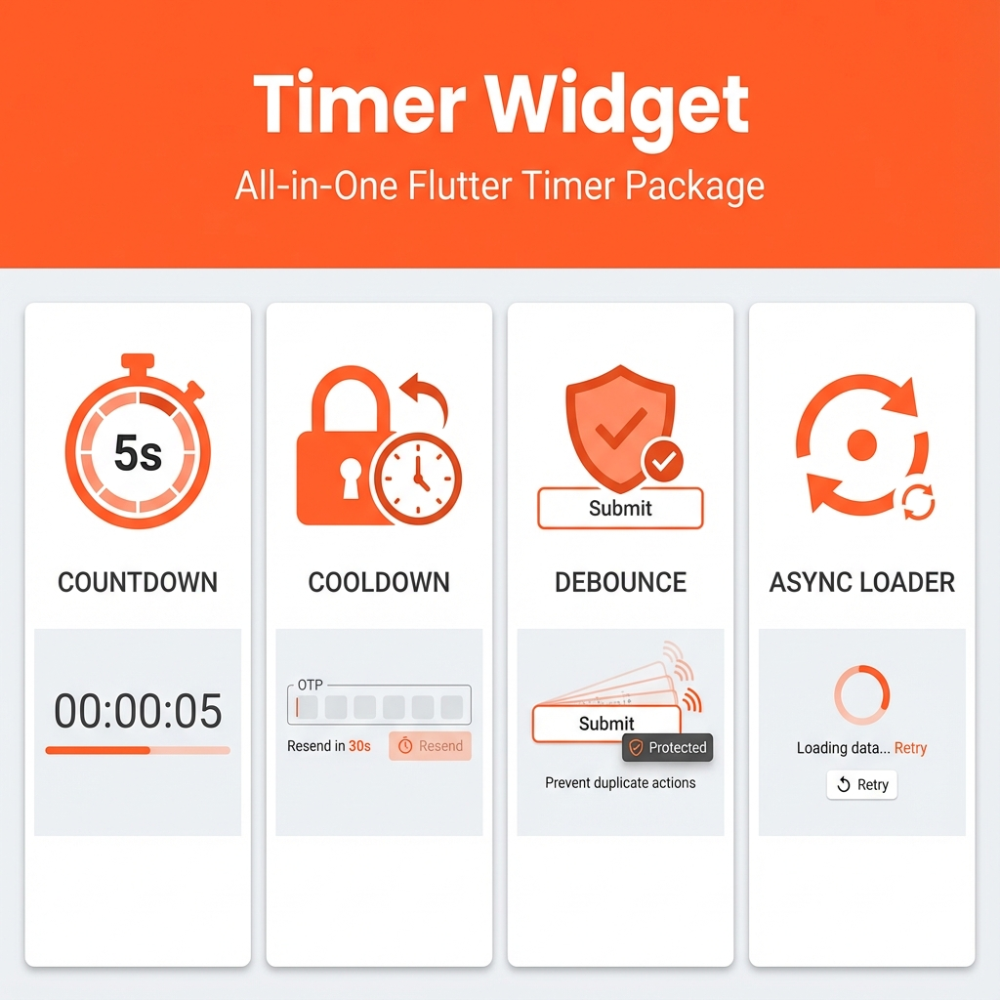

# Timer Widget
- 🌍 updated by livedbs (Free Live Database, Storage)
- [livedbs.web.app](https://livedbs.web.app/)

## ✨ Features
- ⏱️ **Countdown Timer** - Simple countdown with pause/resume
- ❄️ **Cooldown Button** - OTP resend, rate-limited actions
- 🛡️ **Debounce Button** - Prevent rapid clicks, form submission
- 🔄 **Async Loader** - API calls with auto-retry support
- 🎮 **Controller** - External control (start, stop, pause, resume)
- 🎨 **Customizable** - Multiple button types, custom styles
- 📦 **Zero Dependencies** - No Provider, no external packages

A powerful, **all-in-one Flutter timer widget** for countdown timers, cooldown buttons, debounce buttons, and async loading. Perfect for **OTP resend**, **rate limiting**, **form submission**, and **API calls with retry**.
**Zero external dependencies** - all state management is handled internally!



[](https://pub.dev/packages/timer_widget)
[](https://pub.dev/packages/timer_widget/score)
[](https://pub.dev/packages/timer_widget/score)
[](https://pub.dev/packages/timer_widget/score)


## 📦 Installation

```yaml
dependencies:
  timer_widget: ^1.0.0
```

```dart
import 'package:timer_widget/timer_widget.dart';
```

## 🎯 One Widget, Four Behaviors

Select the behavior using `timerType`:

```dart
TimerWidget(
  timerType: TimerType.countdown,  // countdown | cooldown | debounce | asyncLoader
  // ...
)
```

| TimerType | Use Case | Example |
|-----------|----------|---------|
| `countdown` | Simple countdown timer | Timeouts, delays |
| `cooldown` | Button with cooldown period | OTP resend, refresh |
| `debounce` | Prevent rapid clicks | Form submission |
| `asyncLoader` | Async operations with retry | API calls, data loading |

## 🚀 Quick Examples

### 1. Countdown Timer

```dart
TimerWidget(
  timerType: TimerType.countdown,
  timeOutInSeconds: 5,
  buttonType: ButtonType.elevated,
  onPressed: () => print("Started!"),
  onComplete: () => print("Done!"),
  builder: (context, state) {
    if (state.isCounting) {
      return Text("Wait ${state.remainingSeconds}s");
    }
    return Text("Click Me");
  },
)
```

### 2. OTP Resend / Cooldown Button

```dart
TimerWidget(
  timerType: TimerType.cooldown,
  timeOutInSeconds: 30,
  buttonType: ButtonType.outline,
  onPressed: () => sendOTP(),
  builder: (context, state) {
    if (state.isCounting) {
      return Text("Resend in ${state.remainingSeconds}s");
    }
    return Text("Send OTP");
  },
)
```

### 3. Debounce Button (Form Submission)

```dart
TimerWidget<void>(
  timerType: TimerType.debounce,
  debounceMs: 500,
  buttonType: ButtonType.elevated,
  asyncOperation: () async {
    await submitForm();
  },
  builder: (context, state) {
    if (state.isLoading) {
      return CircularProgressIndicator();
    }
    return Text("Submit");
  },
)
```

### 4. Async Loader with Auto-Retry

```dart
TimerWidget<UserData>(
  timerType: TimerType.asyncLoader,
  asyncOperation: () => fetchUserData(),
  retryCount: 3,
  retryDelay: Duration(seconds: 1),
  autoStart: true,
  onSuccess: (data) => print("Loaded!"),
  onError: (error) => print("Failed!"),
  builder: (context, state) {
    if (state.isLoading) return CircularProgressIndicator();
    if (state.isError) return Text("Error: ${state.error}");
    if (state.isSuccess) return Text("Data: ${state.data}");
    return Text("Tap to load");
  },
)
```

## 📖 State Object

The builder receives a `TimerWidgetState` with all information:

```dart
builder: (context, state) {
  state.remainingSeconds  // Countdown seconds remaining
  state.isCounting        // Is timer active?
  state.isPaused          // Is timer paused?
  state.isLoading         // Is async operation loading?
  state.isSuccess         // Did async operation succeed?
  state.isError           // Did async operation fail?
  state.data              // Data from successful operation
  state.error             // Error from failed operation
}
```

## 🎮 Controller (Optional)

Use a controller for external control:

```dart
final controller = TimerWidgetController<String>();

// In your widget
TimerWidget(
  controller: controller,
  // ...
)

// Control externally
controller.startTimer();    // Start countdown
controller.stopTimer();     // Stop and reset
controller.pauseTimer();    // Pause countdown
controller.resumeTimer();   // Resume from pause
controller.execute();       // Execute async operation
controller.retry();         // Retry failed operation
controller.reset();         // Reset to initial state

// Read state
controller.isCounting;      // bool
controller.isPaused;        // bool
controller.remainingSeconds;// int
controller.isLoading;       // bool
controller.isSuccess;       // bool
controller.isError;         // bool
controller.data;            // T?
controller.error;           // Object?
```

## ⚙️ All Properties

| Property | Type | Default | Description |
|----------|------|---------|-------------|
| `timerType` | `TimerType` | `countdown` | Widget behavior mode |
| `builder` | `Function` | required | Build the UI |
| `timeOutInSeconds` | `int` | `5` | Countdown/cooldown duration |
| `buttonType` | `ButtonType` | `none` | Button wrapper type |
| `buttonStyle` | `ButtonStyle?` | `null` | Custom button style |
| `disableDuringCounting` | `bool` | `true` | Disable during countdown |
| `autoStart` | `bool` | `false` | Auto-start on mount |
| `onPressed` | `VoidCallback?` | `null` | Press callback |
| `onComplete` | `VoidCallback?` | `null` | Complete callback |
| `asyncOperation` | `Future<T> Function()?` | `null` | Async function |
| `debounceMs` | `int` | `300` | Debounce delay (ms) |
| `retryCount` | `int` | `0` | Auto-retry count |
| `retryDelay` | `Duration` | `1s` | Retry delay |
| `onSuccess` | `Function(T)?` | `null` | Success callback |
| `onError` | `Function(Object)?` | `null` | Error callback |
| `controller` | `TimerWidgetController?` | `null` | External controller |

## 🎨 Button Types

```dart
ButtonType.none      // Raw widget (GestureDetector)
ButtonType.elevated  // ElevatedButton
ButtonType.outline   // OutlinedButton
ButtonType.icon      // IconButton
```

## 📱 Example App

Check the `/example` folder for a complete demo app with all features.

```bash
cd example
flutter run
```

## 🔑 Keywords

`flutter timer`, `countdown widget`, `cooldown button`, `otp resend flutter`, 
`debounce button`, `async loader`, `loading button`, `rate limit`, 
`flutter button timer`, `countdown button`, `timer controller`

## 📄 License

MIT License - see [LICENSE](LICENSE) file for details.

## 🤝 Contributing

Contributions are welcome! Please open an issue or PR on [GitHub](https://github.com/HassanAmeer/timer_widget_flutter_package).


## Our Others packages

[](https://pub.dev/packages/livedb)
[](https://pub.dev/packages/media_link_generator)
[](https://pub.dev/packages/mediagetter)
[](https://pub.dev/packages/contacts_getter)
[](https://pub.dev/packages/timer_widget/)
